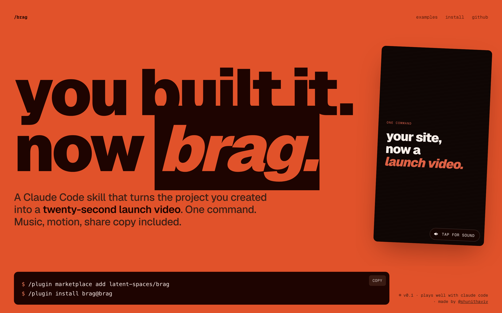

# brag-scaled

**You built it. Now brag — and render it in minutes.**

[](https://github.com/Bhavya-Dhoot/brag-scaled)

`brag-scaled` is a set of agent skills that turn the project you built into a short, shareable launch video, with music, motion, optional narration and share copy.

| Skill | What it does |
|---|---|
| `/brag-slim` | The model builds the whole video itself: story, visuals, soundtrack, share copy. It is the default on Claude Opus 5.5. |
| `/brag` | The classic workflow, which builds and renders through [Hyperframes](https://hyperframes.heygen.com/). |
| `fast-render` | Renders any `window.render(t)` page to MP4 on the GPU with parallel browsers. `/brag-slim` uses it for stills and the final render. |
| `narrate` | Offline voiceover with a bundled 82M-parameter TTS model (Kokoro). It gives exact line timings and ducks the music under the voice. |
| `brag-styles` | 18 art-directed looks, each with a signature motion trick and a matching sound palette (quant terminal, riso zine, blueprint, newsprint, arcade, receipt, transit map, and royal sets from Mughal court to Maharaja Deco). |

## Why it's fast

| Step | Typical approach | brag-scaled |
|---|---|---|
| Drawing frames | Headless Chromium, often on the CPU (SwiftShader) | Pushed onto the GPU; the renderer in use is printed and checked |
| Capture | Screenshots, typically written to disk | Captured over CDP and piped straight into video segments by parallel browsers |
| Encode | One serial pass | Segments encoded in parallel on the best working H.264 encoder (NVENC, Quick Sync, AMF, VideoToolbox, then libx264), after capture finishes |

Measured on Windows 11 with an i9-11950H (16 threads), an RTX A2000 Laptop GPU and an NVMe drive. The test was a 130-second, 60 fps video (7,800 frames at 1080p).

| | time |
|---|---|
| Playwright PNG screenshots to disk, then x264 | ~45 min |
| `fast-render`, default settings | 4 min 46 s |
| `fast-render --encode-jobs 12` (workstation GPU) | 3 min 46 s |

Single frames went from 1.7 s to 75 ms once Chromium was on the GPU. The output decodes within 43.6 dB PSNR of a lossless capture of the same frame. Only the Windows + NVIDIA path is measured so far. The macOS and Linux GPU flags are the documented ANGLE backends, and the renderer line shows what actually ran.

## Install

**Claude Code:**

```bash
claude plugin marketplace add Bhavya-Dhoot/brag-scaled
claude plugin install brag-scaled@brag-scaled
```

**Any other agent**, through the [`skills`](https://github.com/vercel-labs/skills) CLI (Cursor, Codex, Copilot, Gemini CLI, opencode and more):

```bash
npx skills add https://github.com/Bhavya-Dhoot/brag-scaled --skill brag-slim
npx skills add https://github.com/Bhavya-Dhoot/brag-scaled --skill fast-render
npx skills add https://github.com/Bhavya-Dhoot/brag-scaled --skill narrate
```

**Python tools** (`fast-render`, `narrate`):

```bash
pip install playwright imageio-ffmpeg kokoro-onnx soundfile
playwright install chromium
```

The TTS model (about 120 MB) downloads once on the first narration, from this repo's [`tts-v1` release](https://github.com/Bhavya-Dhoot/brag-scaled/releases/tag/tts-v1). It is checked against a SHA-256 and cached in `~/.cache/brag-scaled/`.

### Also works with

This repo exposes the skill at every agent's standard discovery path via symlinks. No extra config needed.

| Agent | How it discovers |
|---|---|
| **Google Antigravity** | Auto-detects from `.agents/skills/brag/` at project root or `~/.gemini/config/skills/brag/` globally |
| **opencode** | Auto-detects from `.opencode/skills/brag/` at project root |
| **Codex CLI** | Reads `.agents/skills/brag/`, walking up to repo root |
| **Claude Code** | Also reads `.claude/skills/brag/` (in addition to the `.claude-plugin/` marketplace install above) |
| **Other agents** | Point custom instructions at `skills/brag/SKILL.md` — see [`docs/other-agents.md`](docs/other-agents.md) |

> **Windows users:** Git requires `git config core.symlinks true` (or `git clone -c core.symlinks=true`) and Windows Developer Mode or Administrator privileges to create symlinks. If symlinks don't work on your system, copy `skills/brag/` to the agent's skill directory manually instead.

## Use it

From any project directory, ask your agent:

```text
let's /brag
```

Steer the tone, or add narration:

```text
/brag --tone "fake Series A launch from 2016"
/brag-slim --voice
/brag-slim --voice bf_emma
/brag-slim --style shahi-darbar
/brag-slim --style the-receipt --tone deadpan
```

The set list, with what each is best for, is in [`skills/brag-styles/SKILL.md`](skills/brag-styles/SKILL.md). Each set has reference frames, and a Stitch prompt for regenerating it (`sets/<slug>/stitch.md`). Import a new Stitch export with `python scripts/import_stitch.py <export-dir>`.

You get a `brag-output/` folder with the plan, share copy, and the rendered `brag.mp4` with its poster frame.

## Requirements

- An agent that supports Agent Skills (Claude Code, opencode, Codex CLI, or any agent with custom instructions)
- Python 3.9+ for `fast-render` and `narrate`
- Node.js 22+ and the Hyperframes CLI, for the classic `/brag` only

## What's in this repo

- `skills/brag-slim/`: the single-file skill
- `skills/fast-render/`: the GPU renderer (`scripts/fastrender.py`)
- `skills/narrate/`: offline narration (`scripts/narrate.py`)
- `skills/brag-styles/`: the 18 visual systems. Each has a `set.md`, which is all a run reads, plus reference frames, `DESIGN.md` tokens and reference markup.
- `scripts/import_stitch.py`: turns a Google Stitch export into sanitised sets
- `skills/brag/`: the classic workflow, with its references and bundled music and SFX
- `examples/`: fake product sites used as a benchmark suite
- `docs/`: the launch site
- `.claude-plugin/`: the plugin manifest and marketplace catalog
- `.claude/skills/`, `.agents/skills/`, `.opencode/skills/`: symlinks into `skills/` for each agent's discovery path

## Credits

- Music: "Happy Beats / Business Moves" by Sascha Ende, [ende.app](https://ende.app/en) (CC BY 4.0)
- Sound effects: [Kenney](https://kenney.nl/) (CC0)
- Voice: [Kokoro-82M](https://huggingface.co/hexgrad/Kokoro-82M) (Apache-2.0), run through [kokoro-onnx](https://github.com/thewh1teagle/kokoro-onnx) (MIT)
- Video generation, in the classic `/brag`: [Hyperframes](https://hyperframes.heygen.com/)

Licences: the code is MIT (see `LICENSE`). Bundled audio and model terms are in [`THIRD_PARTY_NOTICES.md`](THIRD_PARTY_NOTICES.md).

## Contributing

Ideas, fixes and new demo brags are welcome. Open an issue or a PR.
